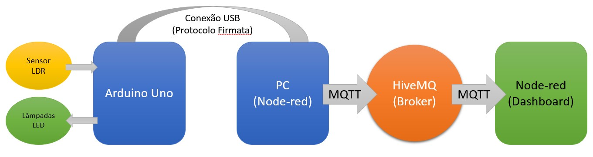
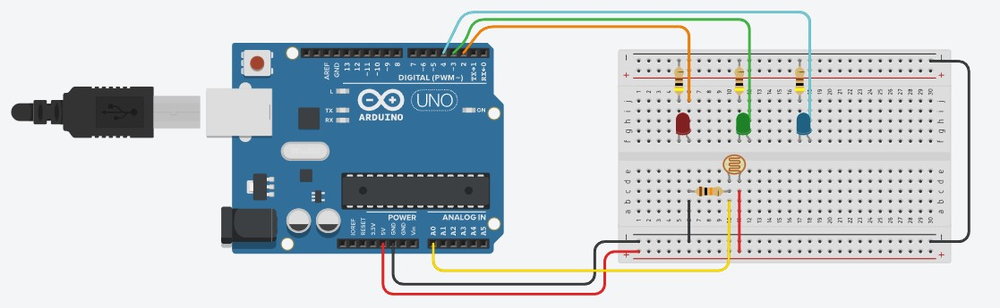
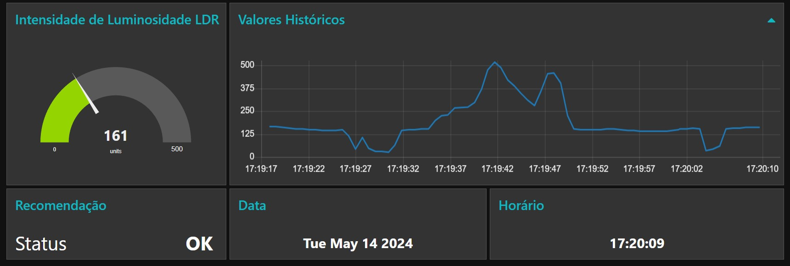

<h1>Monitorador de Luminosidade para o Ciclo Circadiano<h1>

## **Projeto de desenvolvimento de IOT com Arduino**

**O projeto em questão desenvolveu dispositivo inteligente que recomenda aumento, redução ou manutenção da luminosidade do local, com a finalidade de auxiliar pessoas localizadas em mesmo ambiente a se exporem adequadamente a níveis de luz, gerando um hábito saudável para um sono de qualidade.**

**A arquitetura do projeto consiste no dispositivo Arduino sendo responsável pela interação com o mundo real que, por sua vez, estará conectado a um computador, através de cabo USB.**

**Utilizando-se da solução Node-Red, o computador se portará como gateway e transmissor de mensagens via protocolo MQTT para um servidor HiveMQTest disponibilizado publicamente pela empresa HiveMQ.**

**Por fim, o servidor (broker) retransmitirá as informações via protocolo MQTT para uma aplicação geradora de dashboards, neste caso também sendo o Node-Red.**

------

## **Modelo de montagem do dispositivo**

------

## **Dashboard de acompanhamento**

🔎**Maiores detalhes acerca do projeto se encontram em artigo científico disponibilizado**

📃**Código de funcionamento do dispositivo em plataforma Arduino [StandardFirmata_withLightSensor.ino](https://github.com/Jinebas/arduino-light-sensor/blob/master/StandardFirmata_withLightSensor.ino)**
